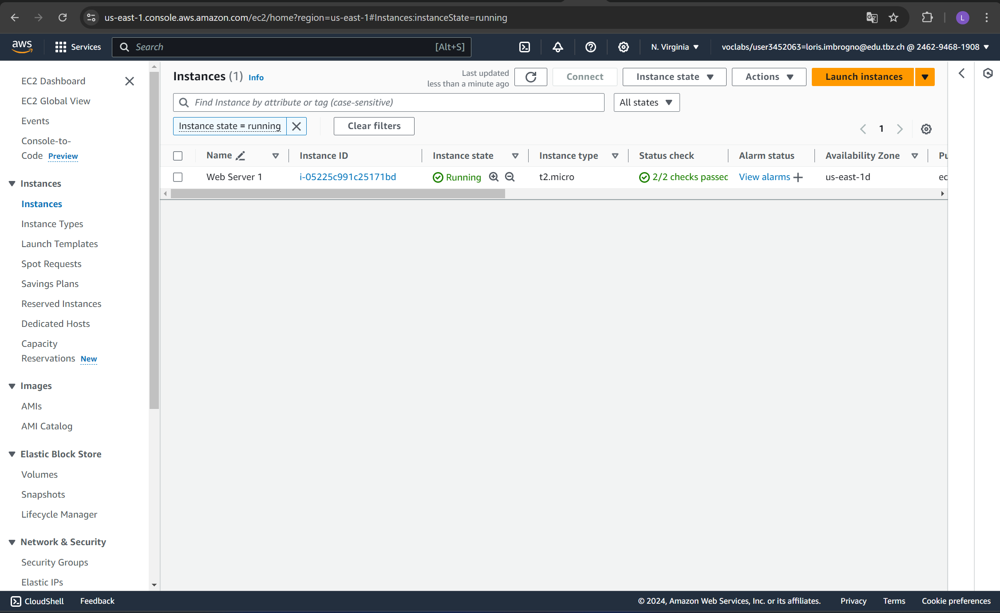
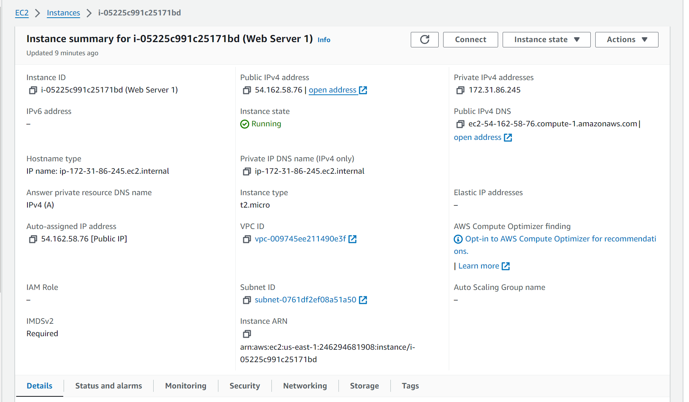
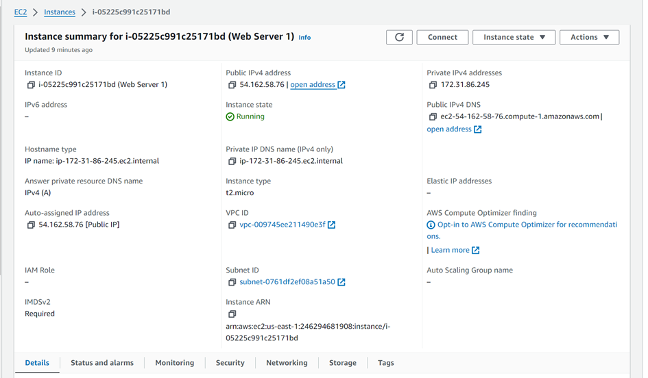
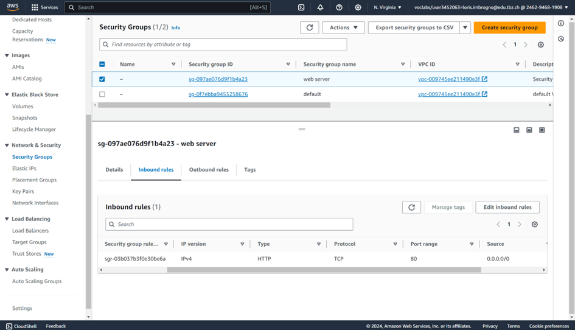
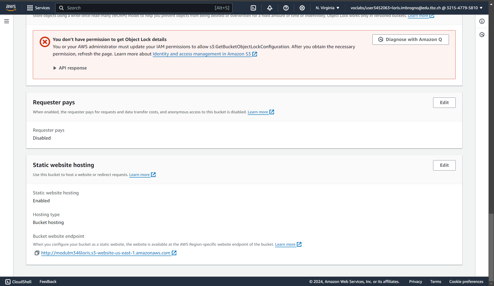
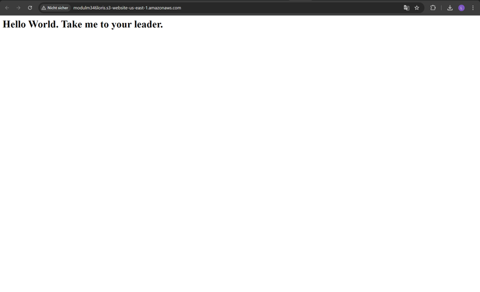
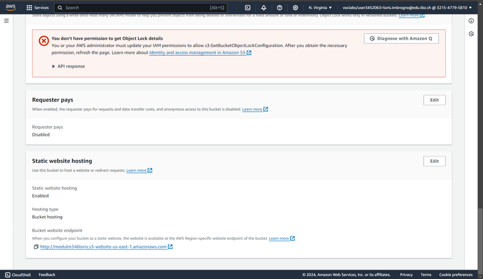
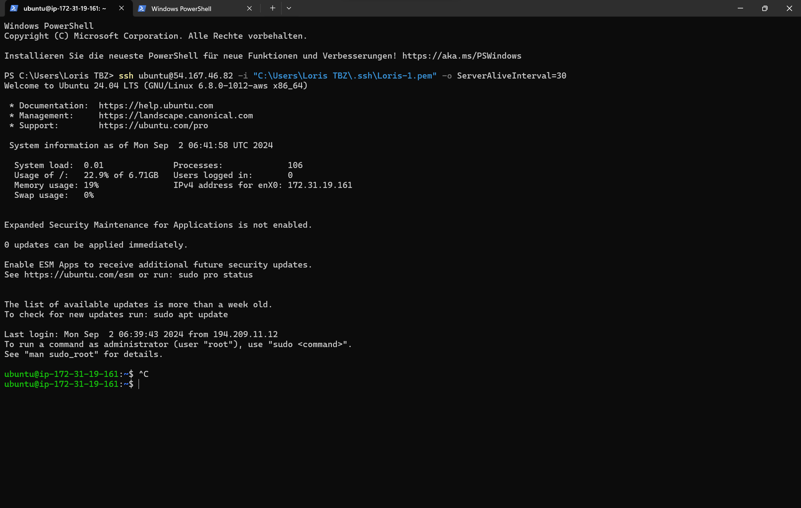
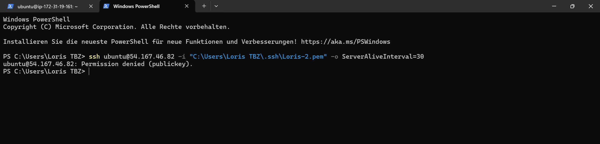
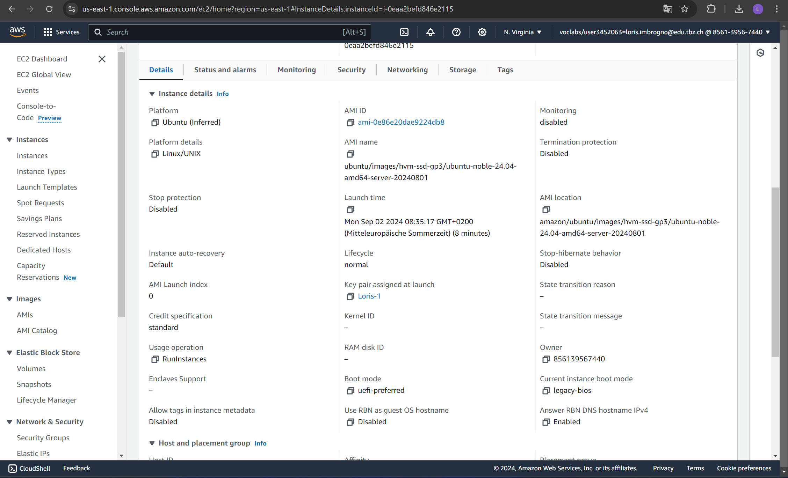

# Lab 4.1 EC2

## AWS Module 1 Notes

### Aufgabe 1

#### Impact of Cloud Computing on Society
Cloud computing has significantly democratized access to advanced technologies, enabling even small businesses and individuals to utilize powerful computing resources without large upfront investments. This shift has fostered innovation, collaboration, and global access to data and services.

#### Surprising Information
It was surprising to see how much cloud computing has accelerated the growth of startups by allowing rapid scaling and reducing financial barriers to entry.

#### Sources and Credibility
Information was sourced from credible industry reports (Gartner, IDC), academic journals, and trusted news outlets like *The New York Times*. These sources are reliable due to their rigorous research, peer review, and expert analysis.

## Aufgabe 2

### Differences in Cloud Service Use
- **IaaS:** Infrastructure as a Service. Businesses rent computing resources like servers and storage, ideal for flexibility and control.
- **PaaS:** Platform as a Service. Provides platforms for developing and managing applications, streamlining the development process.
- **SaaS:** Software as a Service. Offers software on a subscription basis, commonly used for tools like CRM and office productivity.

### Most Important Service
**SaaS** is likely the most important, as it provides easy, cost-effective access to essential software, allowing businesses to focus on their core activities.

### Advice for Starting a Business
Start with **SaaS** for essential tools, then consider **IaaS** or **PaaS** as your business grows and needs more flexibility or custom development.

---

# AWS Module 2

*(The rest of the module was simply read without further notes.)*

---

# AWS Module 4.1

- **HTML Page:** [http://54.162.58.76/](http://54.162.58.76/)
  - 

- **List of Instances:**
  - 

  - **Details of the Webserver Instance:**
  - 

- **Inbound Rule:**
  - 

---

# Lab 4.2 S3

- **List of Buckets:**
  - 

- **HTML Page:** [http://modulm346loris.s3-website-us-east-1.amazonaws.com/](http://modulm346loris.s3-website-us-east-1.amazonaws.com/)
  - 

- **List of Files in the Bucket:**
  - 

- **Properties of "Static Website Hosting":**
  -

### JSON for Public Access
```json
{
  "Version": "2012-10-17",
  "Statement": [
    {
      "Sid": "PublicReadGetObject",
      "Effect": "Allow",
      "Principal": "*",
      "Action": "s3:GetObject",
      "Resource": "arn:aws:s3:::modulm346loris/*"
    }
  ]
}
```

# Zugriff mit SSH-key

## Zugriff mit dem ersten Key-Pair


## Zugriff mit dem zweiten Key-Pair


## Details der Instanz Details
