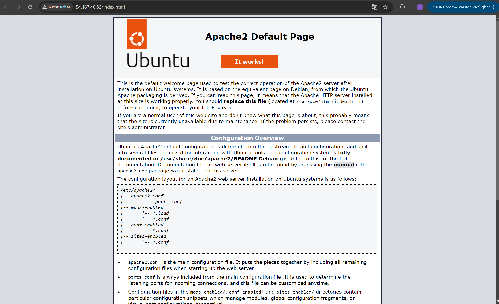
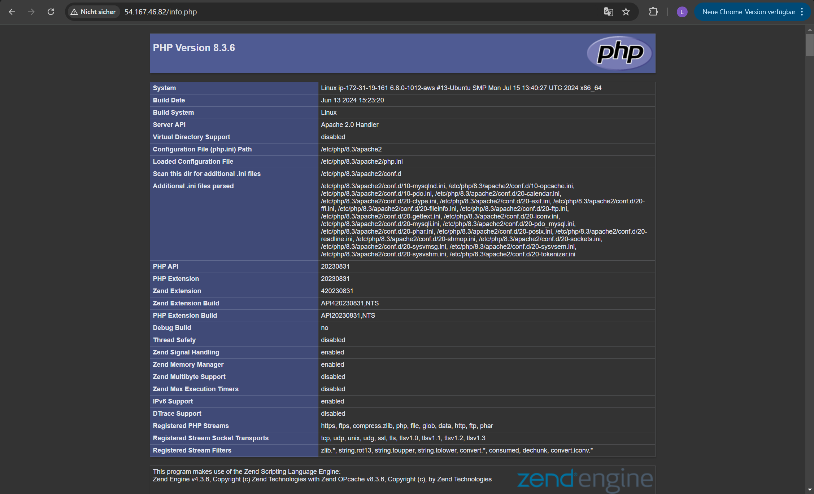
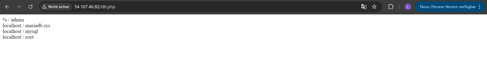
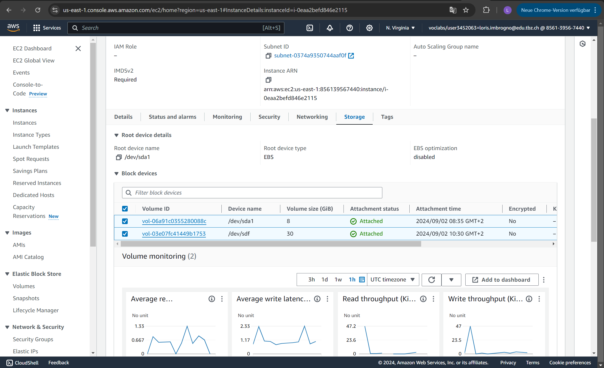

# KN03

## Screenshots zu den Seiten:

## Screenshot der EBS

## Erklärung:
Eine zusätzliche virtuelle Disk kann verwendet werden, um den Speicherplatz zu erweitern, Daten zu organisieren, die Leistung zu verbessern, Backups zu speichern oder spezielle Anforderungen von Anwendungen zu erfüllen, wie z.B. das Speichern von Datenbanken auf separaten Laufwerken.