# KN04
## Aufgabe 1
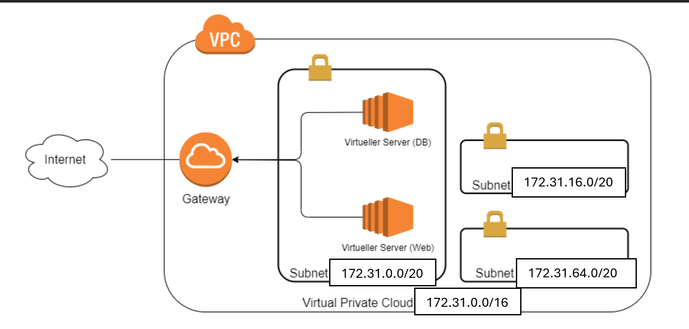

## Aufgabe 2
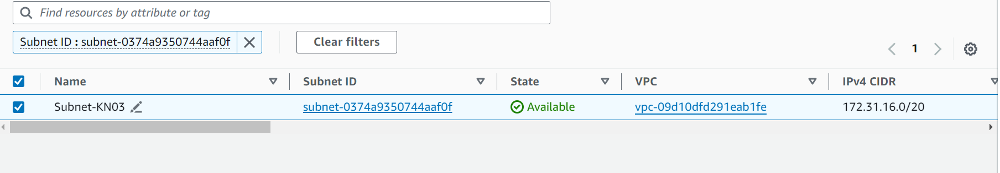
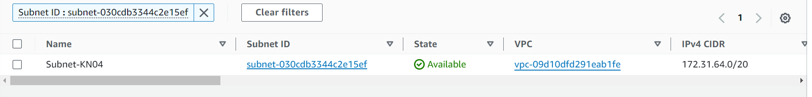

### Definierte IPs
- **Webserver (Subnet-KN03)**: 172.31.16.10
- **DB-Server (Subnet-KN04)**: 172.31.64.20

## Aufgabe 3
### Liste der Security Groups
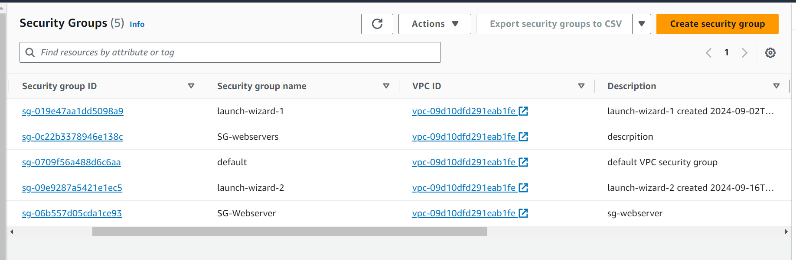
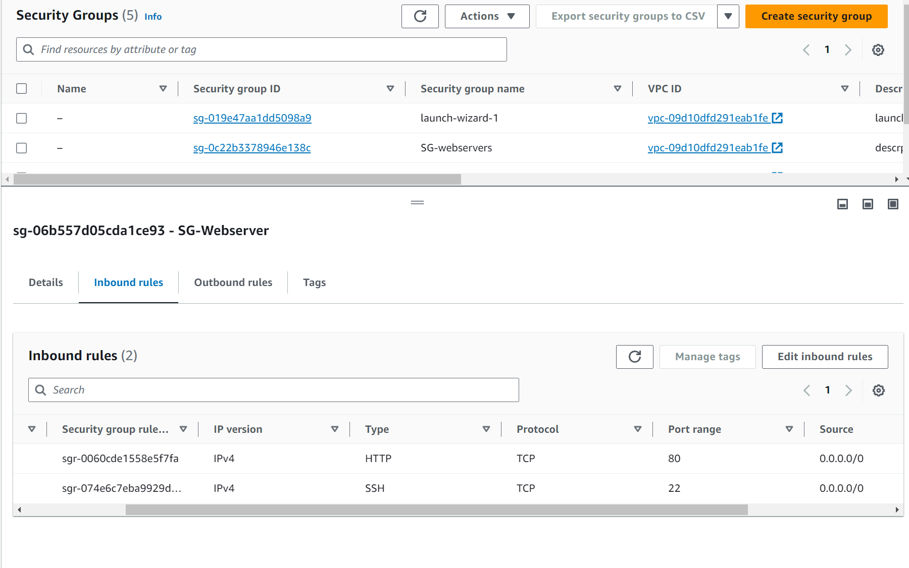
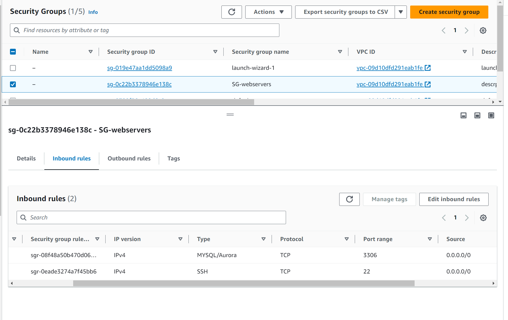
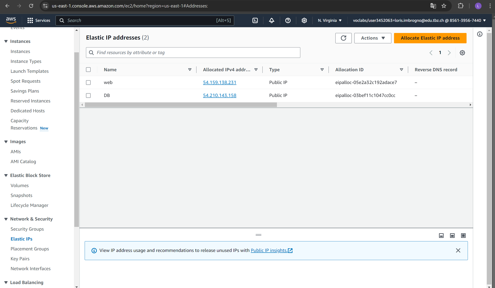
index.html:
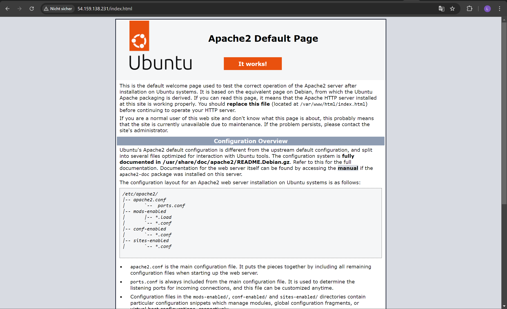
info.php:
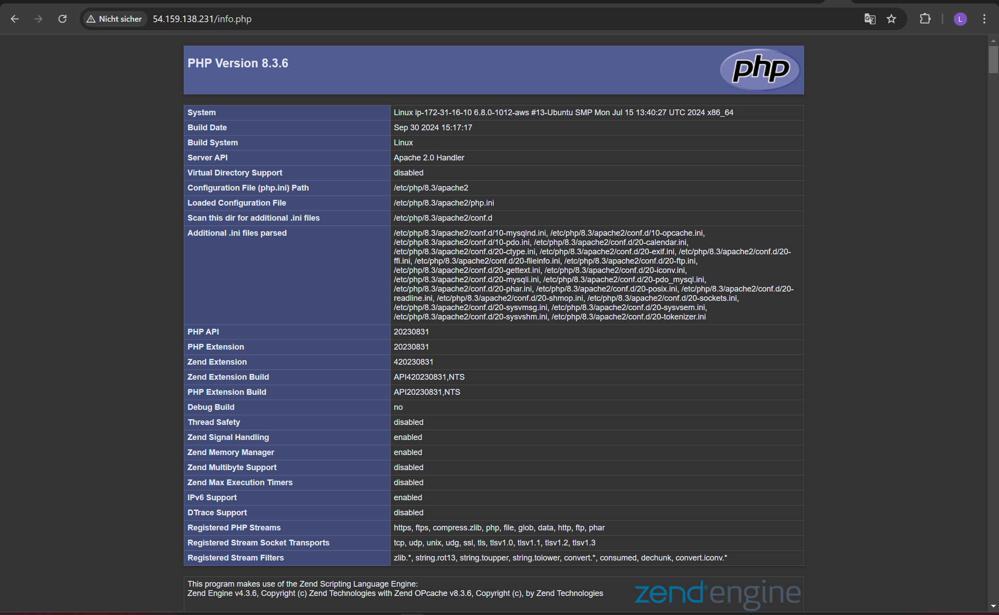
db.php
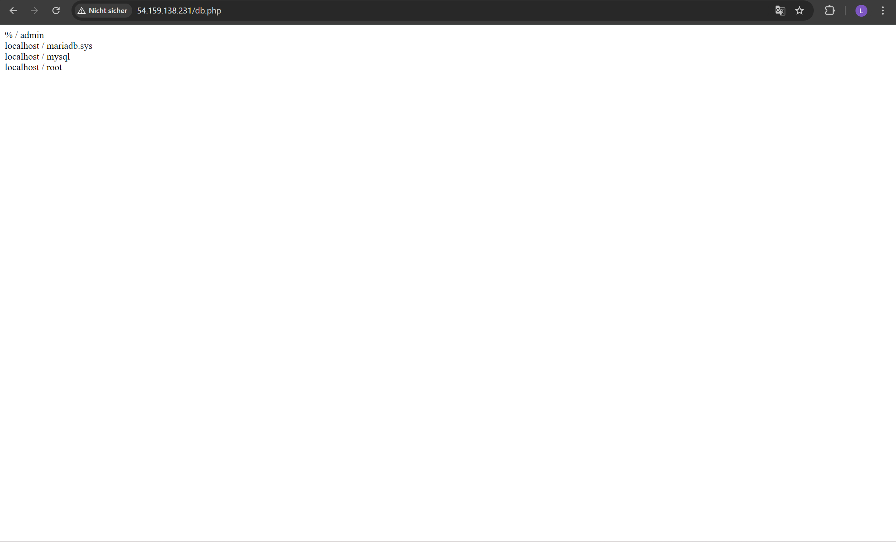

gestoppte server:
db:
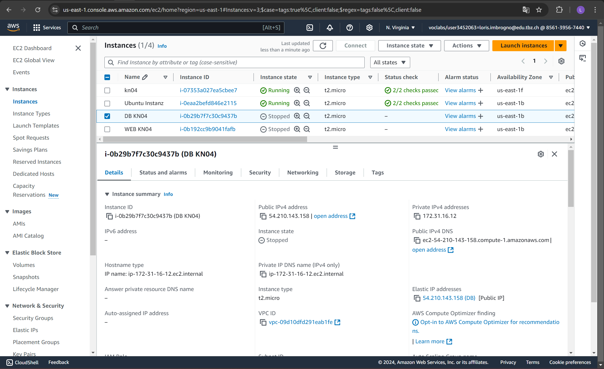
web:
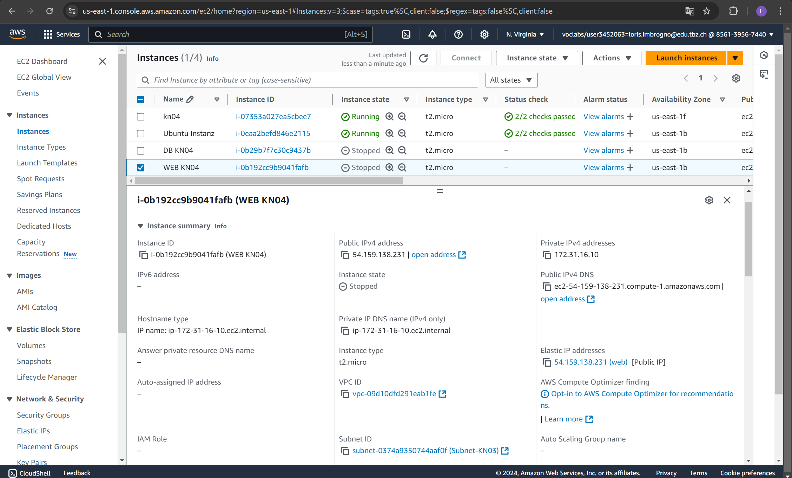
subnet id:
db:
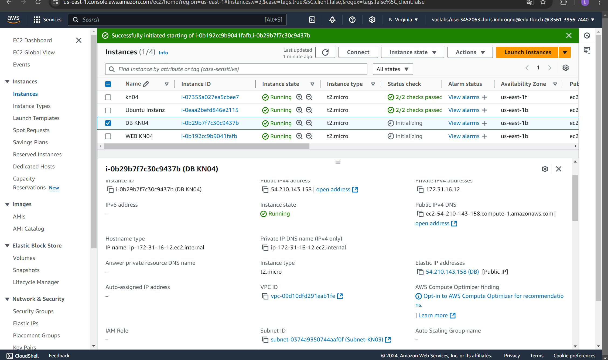
web:
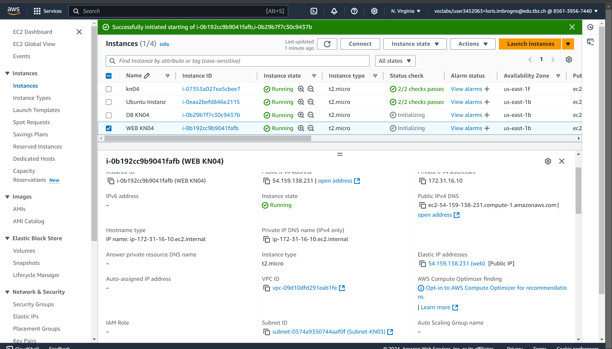