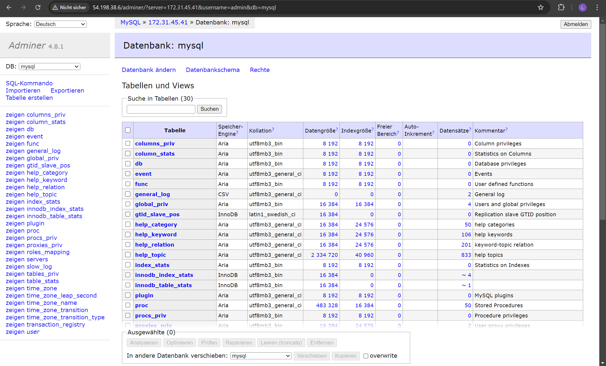
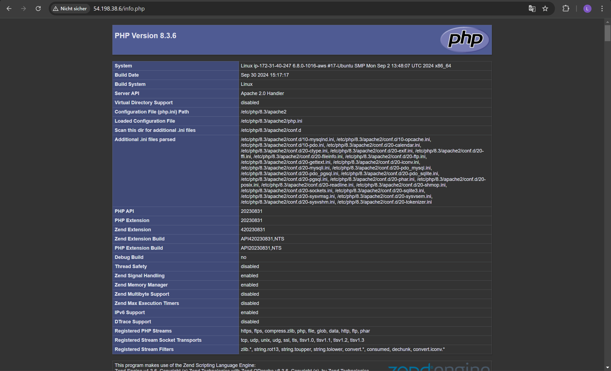
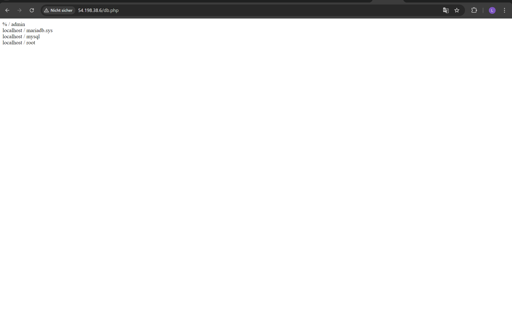
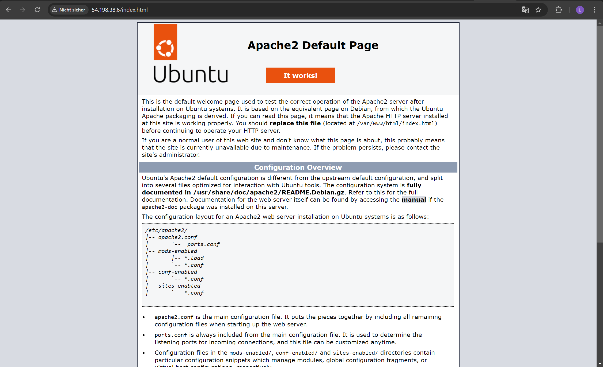

# alle zeilen ausführlich kommentiert:
[cloud-init.yml](./cloud-init.yml)
## Hier ist das yml File mit dem richtigen Key
[cloud-init1.yml](./cloud-init1.yaml)
## Key pair assigned at launch:

## erstes Key pair:

## zweites key pair:

## CLoud Init Screenshot:

## funktionierende Seiten!!

## letzter screenshot
