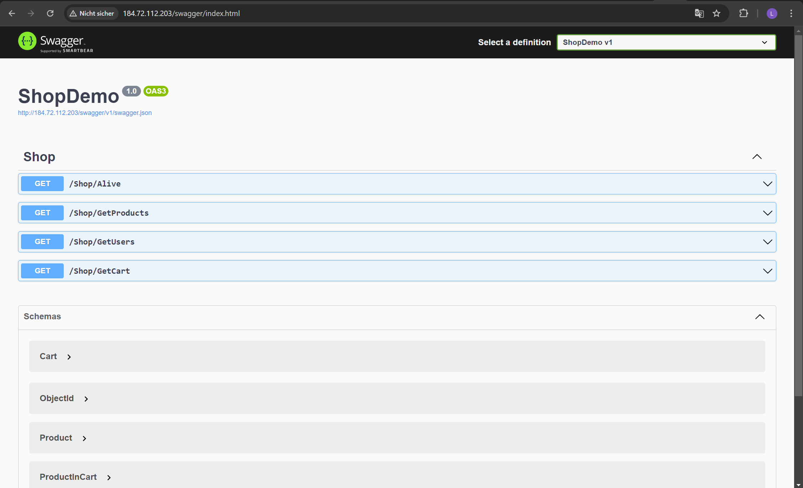
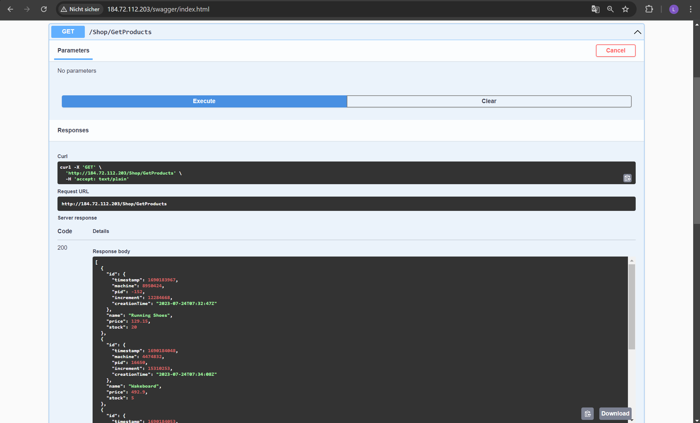
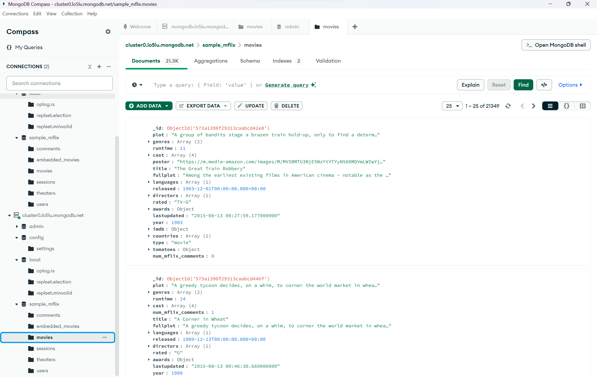
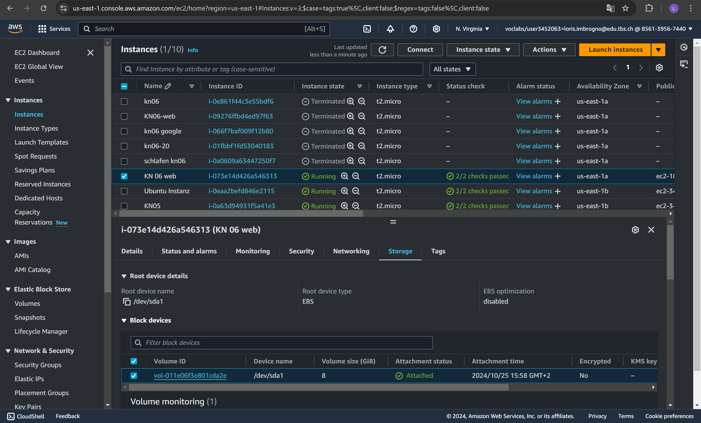
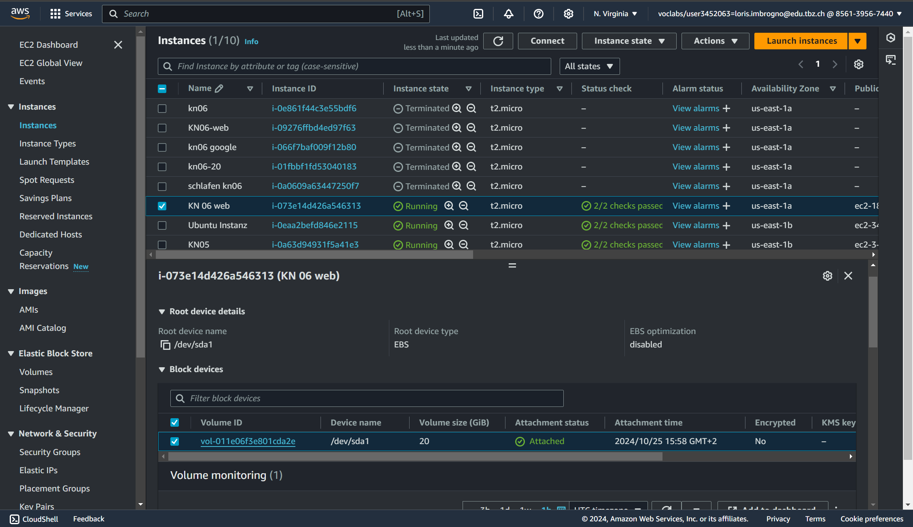
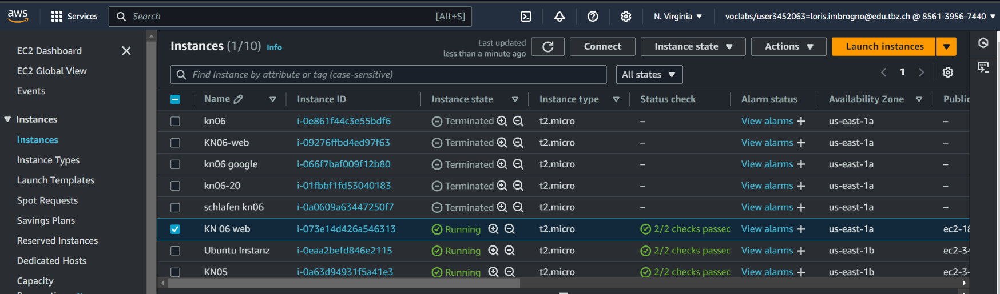
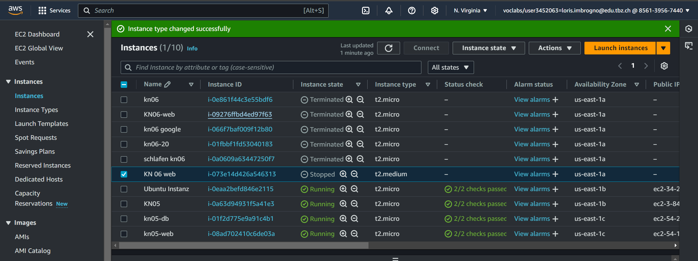

# Abgaben:
Ein Reverse Proxy leitet Anfragen von Nutzern an interne Server weiter, ohne diese direkt sichtbar zu machen. Er erhöht so die Sicherheit und kann den Datenverkehr besser verteilen.

# Vertikale Skalierung:
## before:

## after:

### Laufender Betrieb?
Ja, das Ändern der Festplattengröße ist möglich, ohne die Instanz neu zu starten.

## before:

## after:

### Laufender Betrieb?
Nein, das Ändern des Instanztyps ist nur im gestoppten Zustand möglich.

# Horizontale Skalierung
Wie müssten Sie den DNS konfigurieren, damit die Applikaiton unter URL app.tbz-m346.ch ist?
Damit das möglich ist, muss man einen A-record machen. Das würde die URL von der TBZ mit dem Load balancer DNS von mit verbinden.
Wie müssten Sie den DNS konfigurieren, damit dies funktioniert?
Um app.tbz-m346.ch zu konfigurieren, erstelle ich einen CNAME-Eintrag, der auf die Ziel-Domain (z.B. myapp.heroku.com) verweist. Falls eine IP-Adresse vorhanden ist, kann ich stattdessen einen A-Eintrag mit dieser IP verwenden. Diese Einträge ermöglichen es, dass die Domain auf die Anwendung verweist.