Master Password:
admin1234

# bild (A):
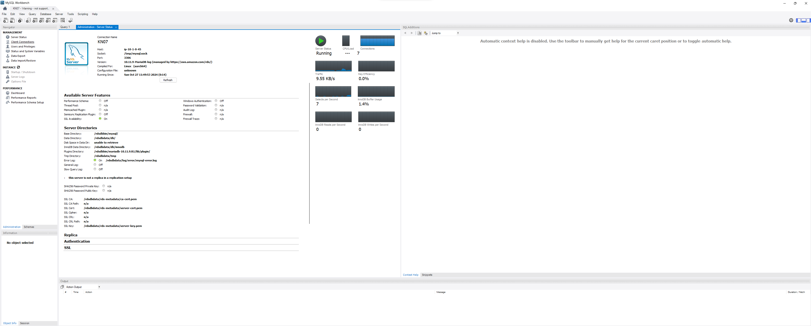
Ein PaaS oder SaaS-Datenbankservice ist  besser, weil er weniger Verwaltungsaufwand erfordert, automatisch skaliert, hohe Verfügbarkeit und Sicherheit bietet und kosteneffizient ist. So kann ich mich auf die Entwicklung konzentrieren, ohne die Infrastruktur selbst betreiben und pflegen zu müssen.
# Screenshots (B):
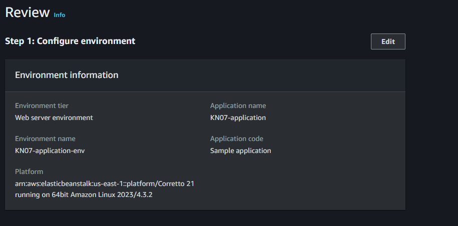
Für das Webserver-Setup habe ich eine internetzugängliche Umgebung gewählt. Der Plattformname "Corretto 21" bietet dabei eine stabile und AWS-optimierte Umgebung, die für die Anwendung Java-Kompatibilität sicherstellt.
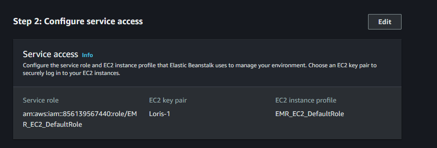
Ich habe die Rolle "EMR_EC2_DefaultRole" genutzt, um der EC2-Instanz die nötigen Zugriffsrechte zu geben. Dadurch wird der sichere Zugriff auf weitere AWS-Dienste möglich und bleibt gleichzeitig unkompliziert.
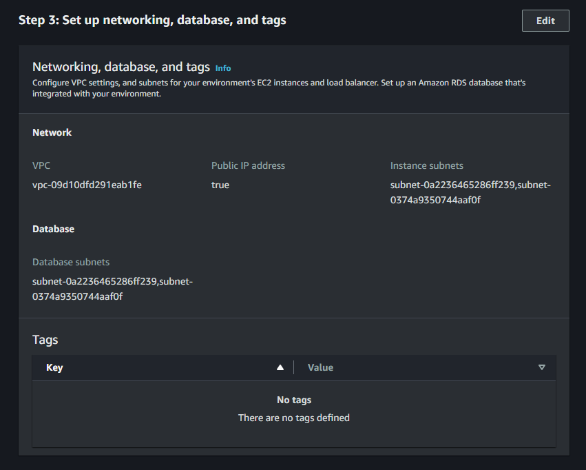
Eine isolierte VPC (Virtual Private Cloud) habe ich eingerichtet, um die Sicherheit der Netzwerkressourcen zu erhöhen. Die Aktivierung einer öffentlichen IP-Adresse erlaubt den Internetzugang, während die Subnetze eine sichere Verbindung innerhalb des Netzwerks gewährleisten.
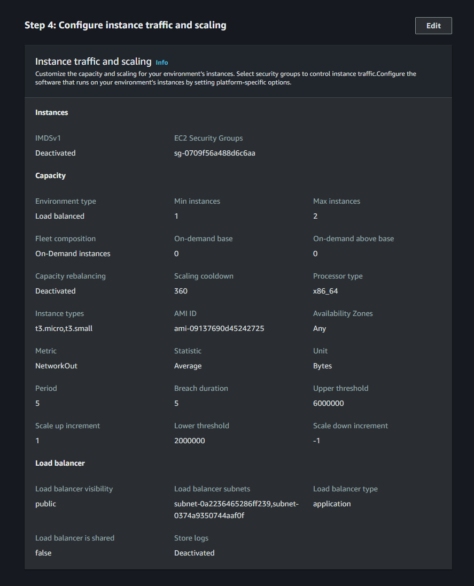
Bei der Instanzkonfiguration habe ich minimale und maximale EC2-Instanzen festgelegt, damit bei schwankendem Traffic automatisch zusätzliche Ressourcen bereitgestellt werden können.
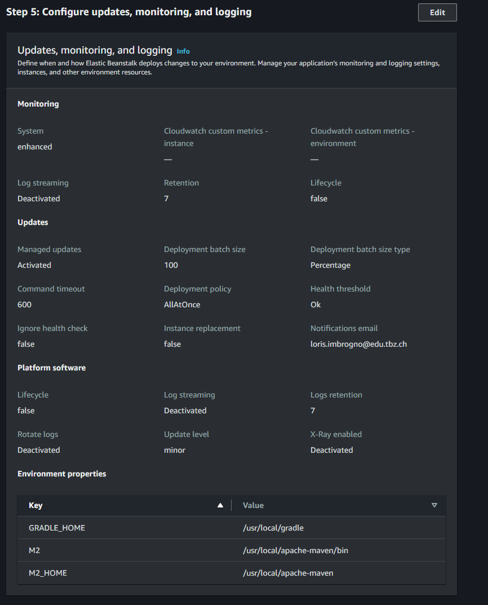
Um den Wartungsaufwand zu verringern, habe ich automatische Updates aktiviert, die sicherstellen, dass alle Sicherheits- und Leistungsverbesserungen zeitnah umgesetzt werden. Das Logging ist momentan deaktiviert, kann jedoch bei Bedarf jederzeit aktiviert werden.
# (B2)
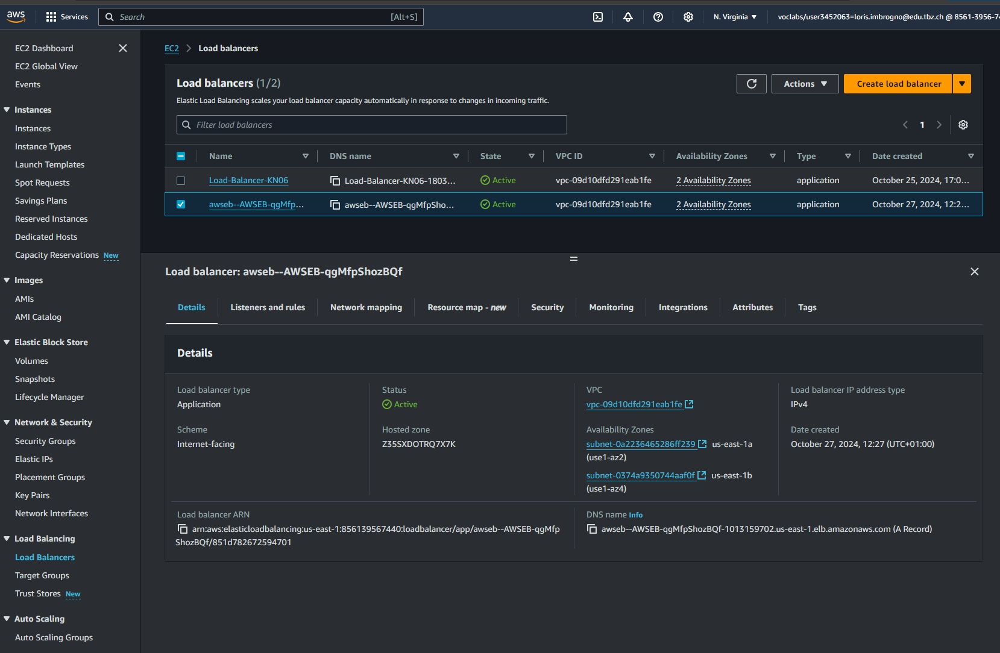
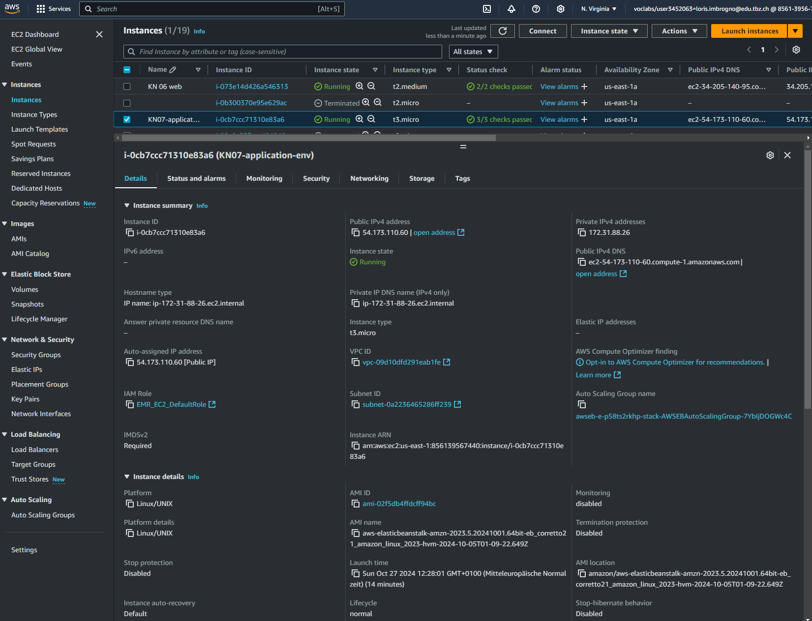
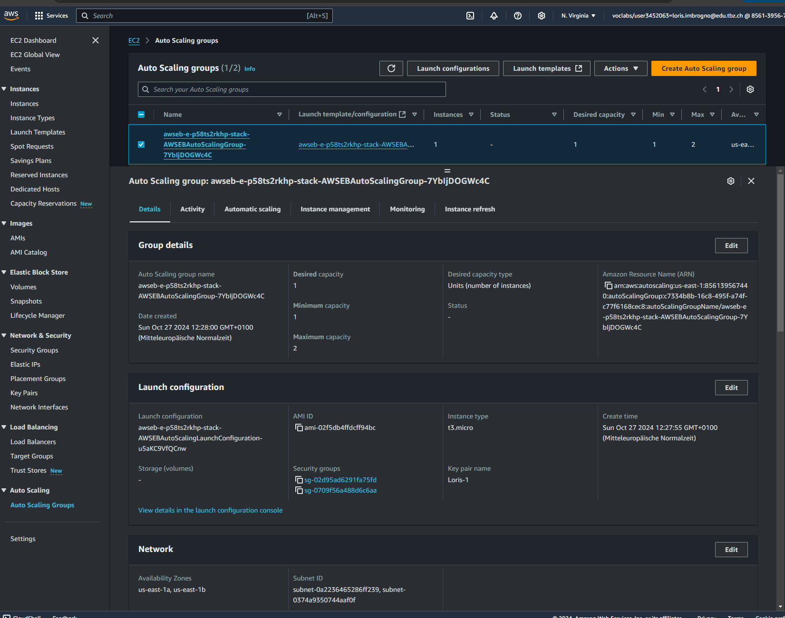
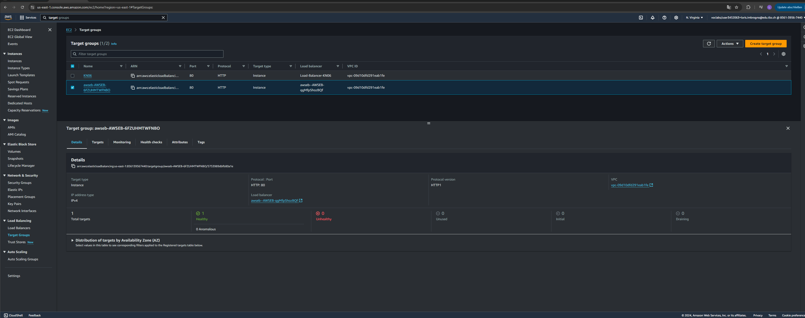
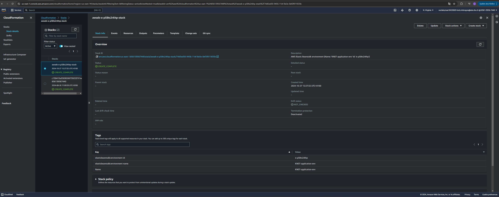
CloudFormation ist ein AWS-Tool zur Bereitstellung und Verwaltung ganzer Infrastrukturen als Code. Cloud-Init konfiguriert dagegen einzelne EC2-Instanzen beim Start. CloudFormation orchestriert die gesamte Umgebung, während Cloud-Init nur die Instanz-Initialisierung automatisiert.

**Vergleich der Auto-Scaling-Gruppe mit KN06:**

- **Kapazität:** Die aktuelle Auto-Scaling-Gruppe ist auf eine gewünschte Kapazität von 1 Instanz eingestellt, während KN06-AS mit 2 Instanzen konfiguriert ist. Dies deutet darauf hin, dass KN06-AS auf höhere oder stabilere Lasten ausgelegt ist.

- **Availability Zones:** Die ausgewählte Gruppe nutzt die Availability Zones `us-east-1a` und `us-east-1c`, wohingegen KN06-AS ausschließlich `us-east-1b` verwendet. Die Verteilung über mehrere Zonen erhöht die Ausfallsicherheit der ausgewählten Gruppe.

- **Instanztyp:** Beide Gruppen verwenden den Instanztyp `t3.micro`, was darauf hinweist, dass sie für leichte Workloads geeignet sind. Die unterschiedlichen Kapazitäten zeigen jedoch, dass sie an verschiedene Lastanforderungen angepasst wurden.

