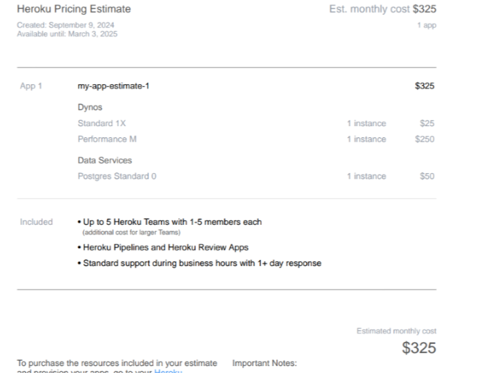
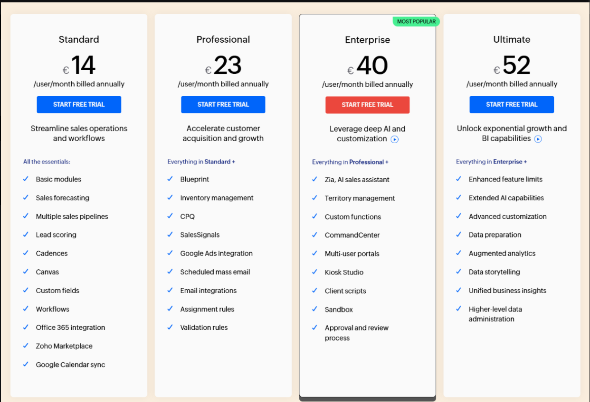
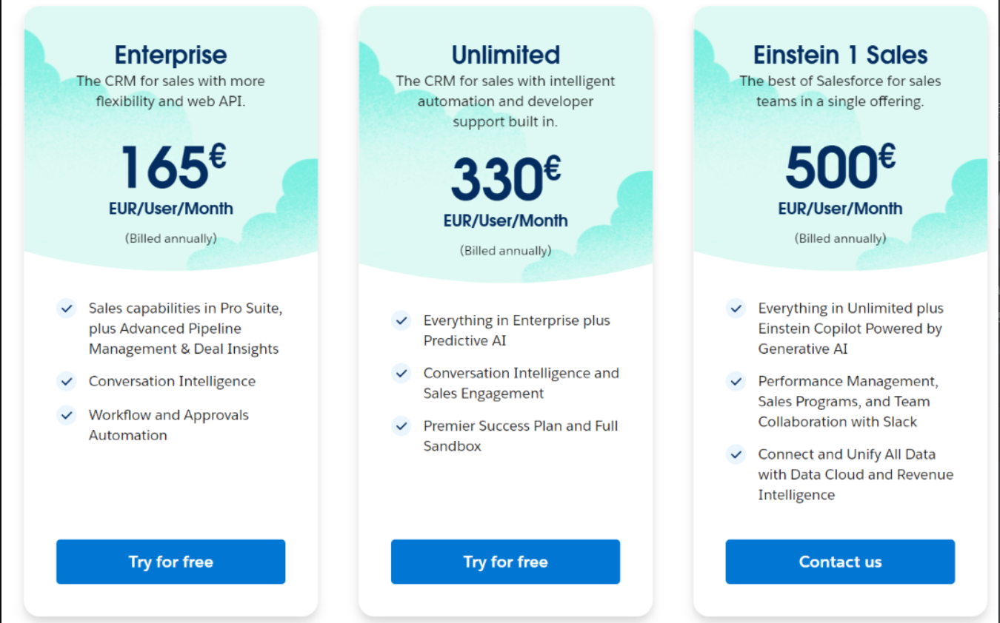

# Aufgaben A

## 1) Rehosting

Für die Option des Rehostings beschränkt sich die Firma auf die beiden Public-Cloud-Anbieter AWS und Azure. Verwenden Sie die Kostenrechner (oben verlinkt) der beiden Anbieter, um die folgenden Anforderungen zu berechnen:

- **1 Webserver:**  
  - 1 Core  
  - 20 GB Speicher  
  - 2 GB RAM  
  - Betriebssystem: Ubuntu
  
- **1 Datenbankserver:**  
  - 2 Cores  
  - 100 GB Speicher  
  - 4 GB RAM  
  - Betriebssystem: Ubuntu
  
Zusätzlich soll ein **Load Balancer** verwendet werden, um zukünftige Skalierbarkeit zu gewährleisten, indem bei Bedarf einfach weitere Server hinzugefügt werden können.

Für die Datenbank ist außerdem ein **Backup-Speicher** vorgesehen, mit folgenden Backup-Zyklen:
- Tägliche Backups für die letzten 7 Tage
- Wöchentliche Backups für den letzten Monat
- Monatliche Backups für die letzten drei Monate

### Abgabe:
- **Screenshot** der Kostenrechnungen (von AWS und/oder Azure)
- **Erläuterung** zu Ihrer Auswahl, mit Begründung, warum die getroffene Wahl sinnvoll ist.

---

## 2) Replatforming

Ihre Firma plant, Heroku als Plattform zu nutzen. Die Kosten für die Entwicklung oder Anpassung der Software werden dabei ignoriert. Verwenden Sie die gleichen Parameter wie in Aufgabe 1 als Grundlage.

### Abgabe:
- **Screenshot** der Kostenrechnung von Heroku
- **Erläuterung** zu Ihrer Auswahl, mit Begründung, warum die getroffene Wahl sinnvoll ist.

---

## Screenshots

### 1. Rehosting (AWS oder Azure)
  

**Begründung:**  
Ich würde Amazon bevorzugen, da es eine benutzerfreundlichere Oberfläche bietet und die Arbeit dadurch effizienter gestaltet wird. Mit Azure konnten wir die Aufgaben zwar schneller abschliessen aber ich finde trotzdem, dass man mit Amazon mehr einstellen kann. 

### 2. Replatforming (Heroku)

**Begründung:**  
Heroku bietet eine hervorragende Plattform-as-a-Service (PaaS) Lösung, die sich durch einfache Bedienbarkeit und automatische Skalierung auszeichnet. Diese Plattform nimmt uns viele Infrastrukturaufgaben ab, die wir bei anderen Lösungen selbst verwalten müssten. Für kleinere bis mittlere Projekte ist Heroku besonders attraktiv, da die Integration von Datenbanken, Backups und Skalierungsoptionen ohne großen Aufwand möglich ist. Die Wahl von Heroku reduziert außerdem die Komplexität bei der Verwaltung der Infrastruktur, was Zeit spart und die Entwicklungszyklen verkürzt.

## 3. Repurchasing

**Begründung:**  
Nach eingehender Betrachtung der beiden CRM-Systeme wird **Zoho CRM** ausgewählt. Zoho CRM bietet ein besseres Preis-Leistungs-Verhältnis für kleine und mittelständische Unternehmen. Die Benutzeroberfläche ist einfach zu navigieren, und es bietet alle wesentlichen Funktionen wie Kontaktverwaltung, Lead-Tracking und Automatisierungen, die für die Firma von Nutzen sind. Bei 16 Mitarbeitern ist es wichtig, eine Lösung zu wählen, die sowohl kosteneffizient ist als auch skalierbar bleibt, falls das Unternehmen wächst.

Salesforce Sales Cloud ist zwar eine der mächtigsten und am weitesten verbreiteten CRM-Lösungen, allerdings sind die Kosten deutlich höher, und viele der fortgeschrittenen Funktionen sind für die Bedürfnisse der Firma nicht unbedingt erforderlich. Salesforce könnte für größere Unternehmen oder solche mit komplexeren CRM-Anforderungen sinnvoller sein, jedoch nicht in diesem Fall.

---

### Gegenüberstellung SaaS vs. IaaS und PaaS

- **SaaS (Zoho CRM oder Salesforce Sales Cloud):**  
  Die SaaS-Lösung bietet den Vorteil, dass keine Infrastruktur verwaltet werden muss. Die CRM-Software ist direkt einsatzbereit, ohne dass zusätzliche Konfigurationen oder IT-Kenntnisse nötig sind. Updates, Wartung und Sicherheit werden vom Anbieter übernommen, was den Verwaltungsaufwand minimiert. Diese Lösung ist für Unternehmen sinnvoll, die sich auf ihre Kernkompetenzen konzentrieren möchten, anstatt sich mit IT-Infrastruktur oder Entwicklungsaufgaben zu beschäftigen.

- **IaaS (Rehosting auf AWS oder Azure):**  
  Bei IaaS ist das Unternehmen für die Verwaltung der Infrastruktur verantwortlich, einschließlich der Wartung von Servern, Netzwerken, Speicher und virtuellen Maschinen. Dies bietet mehr Flexibilität und Kontrolle, erfordert jedoch ein höheres Maß an IT-Ressourcen und Expertise. Es wäre nicht ideal, ein CRM-System auf IaaS zu betreiben, da es zusätzlichen Verwaltungsaufwand verursacht und weniger effizient ist.

- **PaaS (Heroku):**  
  PaaS ist eine bessere Wahl als IaaS, wenn es um die Entwicklung und Bereitstellung von eigenen Anwendungen geht, da es die Infrastruktur verwaltet und dem Entwicklungsteam mehr Freiheiten gibt. Allerdings ist eine CRM-Lösung als SaaS die naheliegendere Wahl, da es keinen Bedarf gibt, ein CRM von Grund auf neu zu entwickeln. Die Implementierung eines CRM als PaaS-Anwendung wäre unnötig komplex und ressourcenintensiv.

**Zusammenfassung:**  
Die **SaaS-Lösung** ist die beste Wahl für das Unternehmen in Bezug auf das CRM. Sie erfordert weniger administrativen Aufwand, ist kosteneffizient und skalierbar. IaaS und PaaS wären hier überdimensioniert und unnötig kompliziert. Zusätzliche Punkte, die beachtet werden müssen, sind Datensicherheit und Datenschutz. Bei der Auswahl des SaaS-Anbieters sollte geprüft werden, wie mit sensiblen Kundendaten umgegangen wird und ob der Anbieter den Anforderungen der Datenschutzgrundverordnung (DSGVO) gerecht wird.

# Aufgaben B) Interpretation der Resultate 

### 1. Preisvergleich und Unterschiede der Angebote

Die Analyse der Kostenrechnung für **Rehosting**, **Replatforming** und **Repurchasing** hat gezeigt, dass die Angebote der verschiedenen Anbieter in mehreren Aspekten stark variieren:

- **Rehosting:**  
  - AWS und Azure haben vergleichbare Preismodelle, jedoch unterscheiden sich die Kosten in Abhängigkeit von den spezifischen Konfigurationen und den gewählten Zusatzdiensten wie Load Balancer und Backup-Speicher.
  
- **Replatforming:**  
  - Heroku bietet eine flexible Plattform, die es ermöglicht, Anwendungen einfach zu skalieren. Die Kosten sind hier meist kalkulierbarer, da die Plattform eine feste Preisstruktur für die Nutzung hat.

- **Repurchasing:**  
  - Zwischen Zoho CRM und Salesforce Sales Cloud gibt es erhebliche Preisunterschiede, wobei Zoho CRM die kostengünstigere Lösung ist.

### 2. Welches ist das billigste?

- **Zoho CRM** hat sich als die günstigste Option für das Repurchasing herausgestellt. Für die spezifischen Anforderungen von 16 Mitarbeitern bietet es ein gutes Preis-Leistungs-Verhältnis, da es grundlegende Funktionen zu einem weitaus niedrigeren Preis als Salesforce bereitstellt.

- Im Bereich **Rehosting** können die Preise je nach Konfiguration schwanken, jedoch tendiert Azure oft zu einer wirtschaftlicheren Lösung für die Anforderungen des Unternehmens.

### 3. Wieso ist eines davon viel teurer? Ist es aber wirklich teurer?

- **Salesforce Sales Cloud** ist teurer, weil es ein umfassenderes und leistungsstärkeres System mit erweiterten Funktionen bietet, die auf größere Unternehmen abzielen. Diese zusätzlichen Funktionen rechtfertigen jedoch nicht immer den Preis für ein kleines Unternehmen, das keine komplexen Anforderungen hat.

- Auf den ersten Blick scheint Salesforce teurer zu sein, aber es ist wichtig zu berücksichtigen, dass die Wahl der richtigen Lösung stark von den individuellen Bedürfnissen des Unternehmens abhängt. Für Unternehmen, die in der Zukunft wachsen möchten und auf erweiterte Funktionen angewiesen sind, könnte Salesforce den höheren Preis rechtfertigen. 

- Für **Rehosting** könnte eine gründliche Betrachtung der tatsächlich benötigten Ressourcen dazu führen, dass die Kosten von AWS oder Azure realistischer eingeschätzt werden. Oftmals können Unternehmen mit einer sorgfältigen Planung der Infrastruktur und der Wahl des passenden Preismodells die Kosten minimieren.

### Fazit

Die Entscheidung für eine Cloud-basierte Lösung sollte nicht nur auf den unmittelbaren Kosten basieren, sondern auch auf den langfristigen Anforderungen und der strategischen Ausrichtung des Unternehmens. **Zoho CRM** ist die kosteneffizienteste Lösung für die aktuelle Situation, während die Cloud-Infrastruktur (Rehosting) sorgfältig geplant werden muss, um unnötige Ausgaben zu vermeiden. Die Analyse der Kosten und der angebotenen Funktionen zeigt, dass eine informierte Entscheidung entscheidend für den Erfolg der Migration in die Cloud ist.
