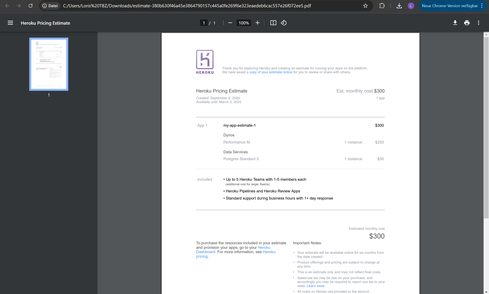

# Aufgaben

## 1) Rehosting

Für die Option des Rehostings beschränkt sich die Firma auf die beiden Public-Cloud-Anbieter AWS und Azure. Verwenden Sie die Kostenrechner (oben verlinkt) der beiden Anbieter, um die folgenden Anforderungen zu berechnen:

- **1 Webserver:**  
  - 1 Core  
  - 20 GB Speicher  
  - 2 GB RAM  
  - Betriebssystem: Ubuntu
  
- **1 Datenbankserver:**  
  - 2 Cores  
  - 100 GB Speicher  
  - 4 GB RAM  
  - Betriebssystem: Ubuntu
  
Zusätzlich soll ein **Load Balancer** verwendet werden, um zukünftige Skalierbarkeit zu gewährleisten, indem bei Bedarf einfach weitere Server hinzugefügt werden können.

Für die Datenbank ist außerdem ein **Backup-Speicher** vorgesehen, mit folgenden Backup-Zyklen:
- Tägliche Backups für die letzten 7 Tage
- Wöchentliche Backups für den letzten Monat
- Monatliche Backups für die letzten drei Monate

### Abgabe:
- **Screenshot** der Kostenrechnungen (von AWS und/oder Azure)
- **Erläuterung** zu Ihrer Auswahl, mit Begründung, warum die getroffene Wahl sinnvoll ist.

---

## 2) Replatforming

Ihre Firma plant, Heroku als Plattform zu nutzen. Die Kosten für die Entwicklung oder Anpassung der Software werden dabei ignoriert. Verwenden Sie die gleichen Parameter wie in Aufgabe 1 als Grundlage.

### Abgabe:
- **Screenshot** der Kostenrechnung von Heroku
- **Erläuterung** zu Ihrer Auswahl, mit Begründung, warum die getroffene Wahl sinnvoll ist.

---

## Screenshots

### 1. Rehosting (AWS oder Azure)
  

**Begründung:**  
Ich würde Microsoft Azure bevorzugen, da es eine benutzerfreundlichere Oberfläche bietet und die Arbeit dadurch effizienter gestaltet wird. Mit Azure konnten wir die Aufgaben schneller abschließen, während der Prozess bei Amazon Web Services (AWS) deutlich länger gedauert hat.

### 2. Replatforming (Heroku)

